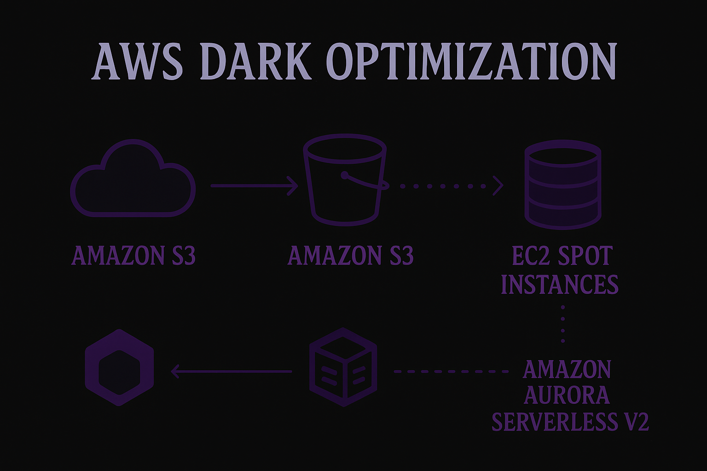

# 🦇 AWS Cost Optimization

### **Relatório de Implementação — Abstergo Industries**

---

## 🕸️ **Visão Geral do Projeto**

### 🔮 Badges

---

### 🗺️ Diagrama Dark da Arquitetura

  

Este repositório contém o relatório completo da implementação de três serviços AWS focados em **redução imediata de custos**, aplicados na **Abstergo Industries**. Todo o material foi adaptado em um estilo **canvas gótico/dark**, oferecendo clareza visual, estrutura limpa e uma identidade marcante para apresentação profissional.

---

## 🪦 **Objetivo do Projeto**

Reduzir custos de infraestrutura em nuvem utilizando serviços AWS otimizados, preservando desempenho e permitindo escalabilidade sob demanda.

---

## 🧩 **Etapas da Implementação**

### **1. Amazon S3 — Armazenamento Inteligente**

* **Foco:** redução de custos com arquivos, backups e logs.
* **Uso:** migração completa para S3 + regras de *Lifecycle Management*.
* **Benefício:** armazenamento 70% mais barato graças aos tiers Automáticos.

---

### **2. EC2 Spot Instances — Processamento Econômico**

* **Foco:** substituir instâncias On-Demand.
* **Uso:** cargas de processamento tolerantes à interrupção.
* **Benefício:** economia de 70% a 90% no custo de computação.

---

### **3. Aurora Serverless v2 — Banco de Dados Elástico**

* **Foco:** eliminar pagamento contínuo por capacidade ociosa.
* **Uso:** escalabilidade automatizada baseada em demanda real.
* **Benefício:** custos reduzidos drasticamente fora do horário comercial.

---

## 🕯️ **Conclusão**

A implementação trouxe economia imediata, maior automação, aumento de disponibilidade e uma base sólida para expansão da infraestrutura. O uso contínuo dessas soluções garantirá otimização permanente.

---

## 📎 **Anexos**

* Relatório completo em PDF (versão dark)
* Diagramas de arquitetura (tema shadow)
* Planilhas de consumo AWS
* Políticas S3 Lifecycle

---

## ✒️ **Responsável pelo Projeto**

**Thaís de Sousa Campos**
